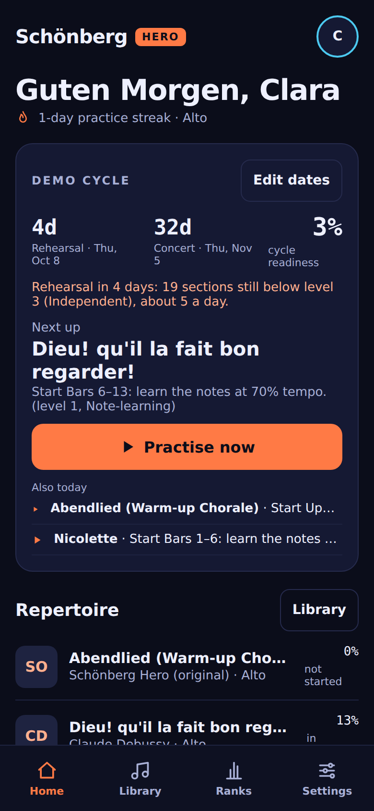
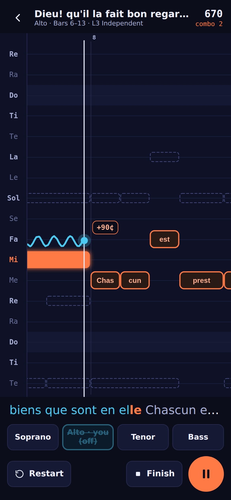
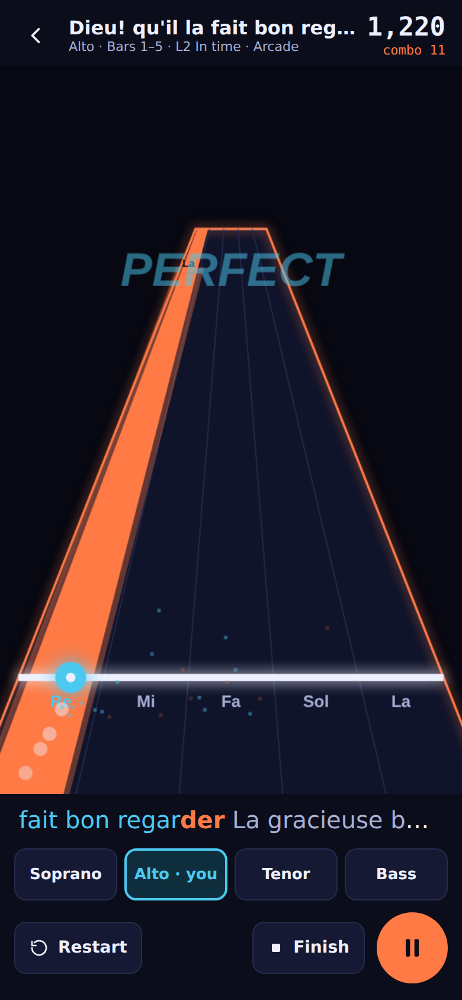
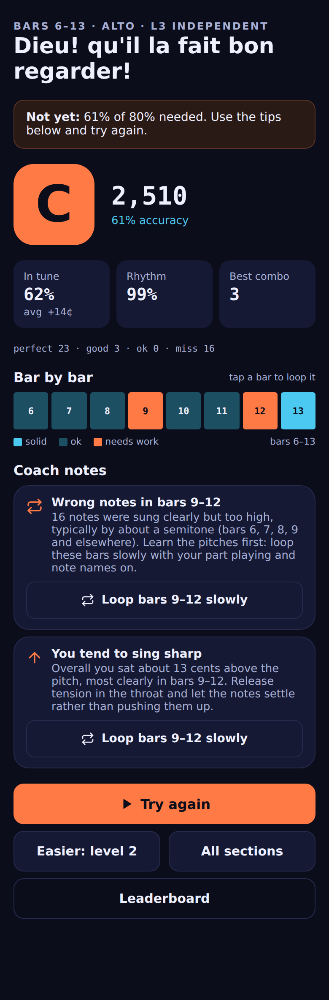

# Schönberg Hero

A Guitar-Hero-style **part-learning trainer for choirs**. Sing your part into your
phone. Notes scroll toward you, your voice draws a live pitch line, and every
phrase climbs a mastery ladder until it's concert-ready.

Built for a young, high-level chamber choir (Poulenc, Ravel, Debussy, early Schoenberg),
so it takes intonation seriously: cents-level feedback, a chord-aware just-intonation
target, movable/fixed solfège and Chinese numbered notation (jianpu), and an atonal
**Zwölfton** expert mode.

<p>
  
  
  
  
</p>

**Live:** https://messiermarathon-latest.onrender.com/schonberg/ (open on your phone, then *Add to Home Screen*).

## Features

- **Repertoire:** import your choir's **MusicXML** (`.musicxml`, `.xml`, `.mxl`) or **MIDI**.
  Parts, divisi voices, lyrics, tempo and key changes are read automatically. Built in: an
  original warm-up chorale (the Abendlied).
- **Choir library:** choir admins (and the super admin) see a library of public-domain pieces in
  Choir admin: Fauré's *Madrigal* Op. 35, Debussy's *Trois chansons*, Ravel's *Nicolette*, Bruckner's
  *Locus iste*, Brahms's *Schaffe in mir, Gott* (opening) and Vierne's *Kyrie*. One tap ("Add to our
  choir") copies the score into the choir's scores on the server and puts it into the programme;
  members get it with the choir sync. The files live in `library/` (never in the public build; see
  `library/README.md`).
- **Admin tab:** a phone with a staff login gets one more bottom tab ("Section" for a section lead,
  "Admin" for a choir admin or the super admin), with a sub-tab per role: Choir (programme, scores,
  library, people), Sections (each section's progress, hardest bars, voice ranges), Choirs and Usage
  (super admin). Members never see it. The super admin logs in once at `#/superadmin` (or Settings →
  Super admin) and stays logged in on that phone for 30 days.
- **Coaching ladder:** each piece is split into sections, and each section climbs
  Listen → 1 Note-learning → 2 In time → 3 Independent → 4 Concert-ready → 5 Off book.
  Level 1 is sung slowly on “doo” and needs every note right; the words come in at level 2.
  Support is removed step by step: tempo, your part playing along, note names, and the
  starting pitch. Section levels are practice steps: a **piece** reaches a level when you sing
  it all through at that level in one go and then fix, on its own, any section that slipped (more
  than half slipped, or a run far under the mark, = practice). Every section right first time earns a clean-run star (docs/LEVELS.md).
  Rehearsal-ready = piece level 3, concert-ready = 4, memorised = 5 on two days. Reviews come back after 7 days.
- **Practice mode (2D):** piano-roll highway, live pitch trace, cents readout, other voices as
  ghosts, lyrics, per-voice mixer, slow tempo for level 1.
- **Arcade mode (3D):** notes rush down perspective lanes, combo multiplier,
  PERFECT/GOOD popups. Unlocks per section at level 2.
- **Coach notes after each run:** a bar-by-bar heat strip and diagnoses such as sinking on
  long notes, late entries after rests, scooping, missed leaps and wrong octave, each with a
  one-tap "loop these bars" drill.
- **Expert mode:** a 12-tone row of the day (P/R/I/RI forms), and a leap drill built from the
  hardest intervals in *your own* parts.
- **Leaderboard:** ranked by readiness, 7-day improvement, streak or weekly points. Works
  offline by sharing codes in the choir chat; an optional tiny server (`server/`) gives a
  live choir board.
- **Voice setup:** live tuner, range finder, headphone-delay calibration and notation choice.
- Settings for notation (letters / fixed do / movable do / jianpu / pitch classes),
  strictness, equal vs just intonation, cycle dates, backup/restore.
- Installable **PWA** that works offline. Everything runs on the device; no audio leaves the phone.

## Run it

```bash
npm install
npm run dev        # http://localhost:5173 (use --host to try on your phone over https/tunnel)
npm test           # unit tests (vitest)
npm run e2e        # browser tests (Playwright, fake microphone)
npm run build      # production build in dist/
```

The microphone needs **https** (or localhost). For phones, deploy the `dist/` folder to any
static host (GitHub Pages workflow included in `.github/workflows/pages.yml`, or Render /
Netlify / Vercel).

**Testing without singing:** add `?simulate=perfect` (or `flat`, `sloppy`) to the URL and a
synthetic singer replaces the microphone.

## Docs

- [docs/design-critique.md](docs/design-critique.md): critique of the first design and
  the coaching model that came out of it
- [docs/architecture.md](docs/architecture.md): module contracts
- [docs/priorities.md](docs/priorities.md): P0–P3 bug scale used in testing
- [content/raw/SOURCES.md](content/raw/SOURCES.md): sources and licences of the demo scores
- [library/README.md](library/README.md): the choir library (admins only): sources, editions and licences

## Licences of demo and library content

The choir library's Debussy, Ravel, Bruckner and Brahms editions (and the Reger, Elgar and Bach files in `content/raw/`) come from the
[PDMX dataset](https://zenodo.org/records/15571083) (CC BY 4.0), which collects
MuseScore.com scores marked Public Domain / CC0 by their uploaders; the Vierne *Kyrie* is Manfred Hößl's
CPDL edition (#30138). Fauré's *Madrigal* Op. 35 is Robert Kerr's edition for the William Byrd Singers,
Manchester, licensed CC BY-SA 4.0. The compositions themselves are in the public domain. Each piece's
credit is shown with it in the app (`library/index.json`, `library/README.md`).

The treble and bass clefs in the score view are outlines from the [Bravura](https://github.com/steinbergmedia/bravura)
music font (© Steinberg Media Technologies GmbH), used under the SIL Open Font License 1.1
(`public/licenses/Bravura-OFL.txt`).
